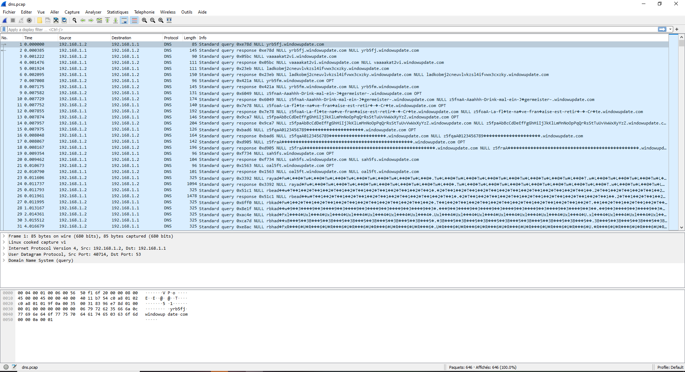
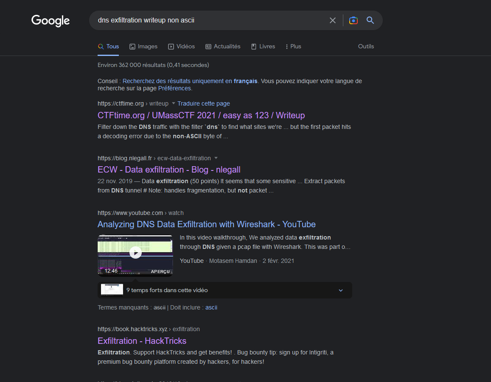
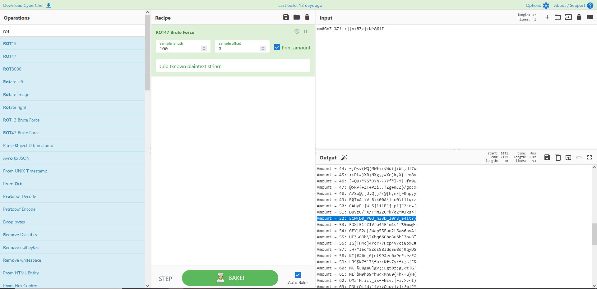

# cry me a river

### European Cyber Week CTF 2022

### Stats

Orgaisateurs  :  **Seela**

Category         :  **Network**

### cry me a river

#### Description : A suitcase mysteriously disappeared from one of our flight. Our NOC team noticed unusal network flows. They sent you the packet capture. You're our last hope, no one has been able to sovle this mystery so far

Je ne pense pas avoir résolu le challenge de la façon attendue, mais je trouve ma méthode intéressante car elle montre des petites astuces que l'on peut faire en CTF.

Le challenge nous fournit un fichier pcap que j'ouvre naturellement avec Wireshark.



Directement, ça me fait penser à une exfiltration dns. C'est-à-dire que des informations vont transférer en utilisant des sous-domaines. Ici, on le remarque bien avec les grandes lignes de caractères sous le format *.windowupdate.com. Cependant, j'ai remarqué que certains caractères sont affichés bizarrement par Wireshark. Ça vient sûrement du fait que le logiciel essaye de décoder les caractères et que certains ne sont pas ASCII.

Personnellement, je n'avais jamais vu d'exfiltration dns avec des caractères non-ASCII et j'ai donc cherché sur Internet des writeups d'autres ctfs.



Et là, je tombe sur un writeup sur un ancien challenge de l'ECW sur justement l'exfiltration dns. En lisant la [page web](https://blog.nlegall.fr/ecw-data-exfiltration.html) je vois que ses paquets ressemblent un peu aux miens et surtout, il y a un script pour décoder tout ça. Je ne vais pas voler son travail ici mais c'est un script pour décoder les paquets de [iodine](https://code.kryo.se/iodine/). Et après, je tombe sur cette transmission :

```sh
$ python2.7 exploit.py
Successfully extracted 157 packets into inception/extracted.pcap

$ tshark -q -r inception/extracted.pcap -z follow,tcp,ascii,0 

===================================================================
Follow: tcp,ascii
Filter: tcp.stream eq 0
Node 0: 10.42.0.2:42132
Node 1: 10.42.0.1:6661
30
[// Initializing connection ]

        11
WTF Dude?!

        42
You're still playing that old agent game?

23
[// Fetching updates ]

        31
Come on! Stop it! Back to work

41
I'm covering our tracks, you'll thank me

        31
This channel is encrypted dude

18
You're 100% sure?

        52
When you come back here, you're back to training...

        17
You're the worst

5
Well

3
So

57
The plane we're looking for will take off at 1:30PM CEST

25
Flight number is ECW1337

41
Passenger's name on the label is Yasmine

41
She will be traveling with two suitcases

19
Both look the same

        51
Come on, straight to the point, we're wasting time

49
Ok so we need to steal the one with this label :

5
Wait

30
They may see this information

16
I'll encrypt it

        11
Coooome on

56
Remeber our last cybertraining in France with this guy?

        9
Remeber?

10
*Remember

34
I thought we were wasting time...

4
...

        28
Ok so the thing with "euz"?

20
Yes, that's the one

        18
Ok so which part?

7
Crypto

12
My favorite

        6
OK...

34
Remember the first cipher we saw?

        44
Come on, don't use the cipher with rotation

4
Man

19
No one will notice

13
Pure genious

14
Just remember

23
There were two of them

        7
I know

31
I'll be using the advanced one

        22
The one over 13 then?

7
Ssshhh

21
Don't ruin the thing

21
So the other one yes

        67
Please tell me you'll be using a different number than default one

11
Of course!

72
Remember this hilarious sci-fi english boook with the paranoid android?

        63
For sure! Don't panic man, and I always bring a towel with me.

28
Then you'll know the answer

        14
Which answer?

11
THE answer

25
To the ultimate question

8
Of Life

13
the Universe

16
and Everything!

        14
Oh, that one!

        5
Okay

        13
Bring it on!

28
om#GnZ+%Z!+:]]n+8Z>]+N 8@iI

        13
Let me check

        13
You're sure?

        58
Doesn't seem to work here, there is a hole in your thing.

18
Let me check here

4
Oh!

26
nc refused one of my char

11
it lost it

27
So between the N and the @

29
You should have a circumflex

        10
Ok got it

        10
Good luck

37
You need to take me out of here bro!

        4
Bye

===================================================================
```

On peut tirer beaucoup de choses de cette transmission. On a un string "om#GnZ+%Z!+:]]n+8Z>]+N 8@iI", une information comme quoi il nous manque un "^" et on nous parle d'un chiffrement par rotation. Directement, je rectifie mon string en "om#GnZ+%Z!+:]]n+8Z>]+N^8@iI" et j'essaye de brute force la rotation.



Et voilà, on a notre flag. Le but de ce writeup était de montrer qu'il y a toujours plusieurs moyens de résoudre un challenge.

#### `Answer : ECW{D0_Y0U_n33D_l0r3_$4lt?}`

Write-up made wit :heart: by @LaGelee